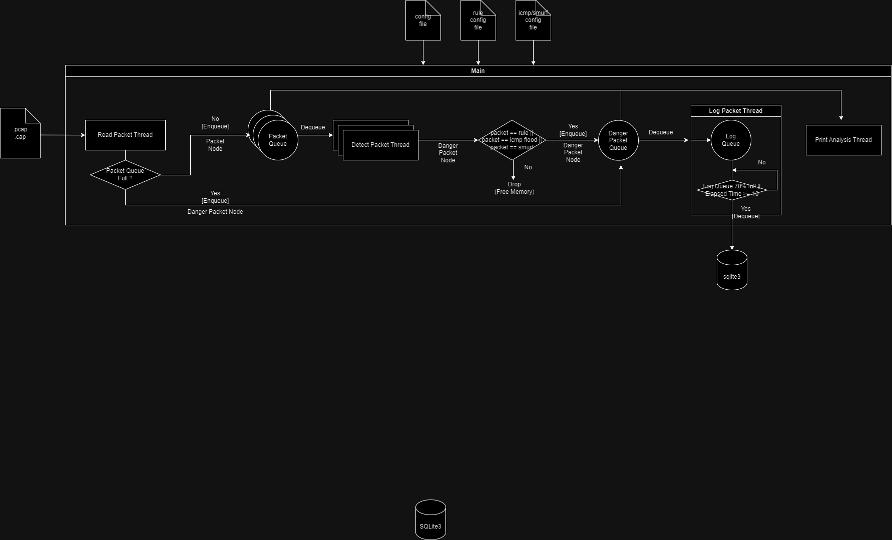

## 프로젝트 개요

소형 IDS를 구현합니다. 해당 프로그램은 아래의 조건을 만족해야 합니다.

* conf 폴더 내의 사용자가 작성한 config 파일을 읽어와 프로그램의 초기 설정을 구축해야 합니다.

  - 파일에서 정의하는 내용: 큐 사이즈, 스레드 개수, 정책 개수, ICMP FLOOD 탐지 여부

* 사용자가 만약 ICMP FLOOD 탐지를 희망한다면, conf 폴더 내의 사용자가 작성한 flood_conf 파일을 읽어와 ICMP FLOOD 탐지 초기 설정을 구축해야 합니다.
  - 파일에서 정의하는 내용: 해시테이블 크기, 공격 인정 시간, 공격 인정 패킷 수

* conf 폴더 내의 사용자가 작성한 rule.txt 파일을 읽어와 IDS가 탐지할 정책을 구축해야 합니다.
  - 파일에서 정의하는 내용: 패턴 블럭을 반드시 포함하고 있는 정책. ip 주소와 포트번호는 선택

* 멀티 스레드로 구현되어야 합니다.

  

## 실행환경

1. linux 
2. gcc c99 이상

## 실행법

1. 원하는 폴더에서 `git clone https://github.com/Hayeon-Lee/IDS.git` 를 입력합니다.
2. conf 폴더 내의 config, flood_conf, rule.txt 를 수정하거나 혹은 그대로 둡니다. 
3. 프로젝트 폴더로 이동 후 `make` 를 입력합니다.
4. `./IDS.out` 를 입력합니다.

## 구조도

1. detectpacket 스레드 1개 당 1개의 원형큐를 갖는다
2. readpacket 스레드는 패킷을 읽으면 라운드로빈 방식으로 원형큐에 패킷을 enqueue 한다
3. detectpacket은 자신이 갖고 있는 원형큐에서 dequeue 하여 정책과 비교하고, 걸리는 패킷을 logqueue에 저장한다.
4. logpacket은 logqueue 최대 크기의 80%가 넘게 패킷이 쌓일 때, 혹은 10초에 한 번씩 logqueue를 비워주며 로그를 저장한다.
5. log파일은 sqlite3에 저장된다.
