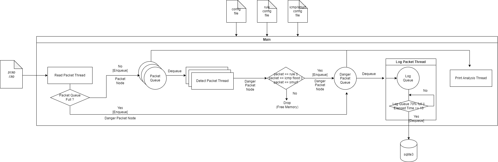

## 프로젝트 개요

소형 IDS를 구현합니다. 해당 프로그램은 아래의 조건을 만족해야 합니다.

* conf 폴더 내의 사용자가 작성한 config 파일을 읽어와 프로그램의 초기 설정을 구축해야 합니다.

  - 파일에서 정의하는 내용: 큐 사이즈, 스레드 개수, 정책 개수, ICMP FLOOD 탐지 여부

* 사용자가 만약 ICMP FLOOD 탐지를 희망한다면, conf 폴더 내의 사용자가 작성한 flood_conf 파일을 읽어와 ICMP FLOOD 탐지 초기 설정을 구축해야 합니다.
  - 파일에서 정의하는 내용: 해시테이블 크기, 공격 인정 시간, 공격 인정 패킷 수

* conf 폴더 내의 사용자가 작성한 rule.txt 파일을 읽어와 IDS가 탐지할 정책을 구축해야 합니다.
  - 파일에서 정의하는 내용: 패턴 블럭을 반드시 포함하고 있는 정책. ip 주소와 포트번호는 선택

* 멀티 스레드로 구현되어야 합니다.

  

## 실행환경

1. linux 
2. gcc c99 이상

 

### 실행법

1. 원하는 폴더에서 `git clone https://github.com/Hayeon-Lee/IDS.git` 를 입력합니다.
2. conf 폴더 내의 config, flood_conf, rule.txt 를 수정하거나 혹은 그대로 둡니다. 
3. 프로젝트 폴더로 이동 후 `make` 를 입력합니다.
4. `./IDS.out` 를 입력합니다.
5. 프로그램을 종료하고 싶을 때는 ctrl + c 를 입력합니다.

 

## 구조도

 

## 프로그램 설명

### 사용자 정의 파일 설명

#### conf/config
1. 큐 사이즈는 이 프로그램에서 사용되는 Packet Queue, Danger Packet Queue, Log Queue 의 사이즈입니다.
2. 스레드 개수는 detect packet thread 의 개수입니다. detect packet thread는 패킷을 파싱하고, 정책과 비교하는 등 타 스레드에 비해 할 일이 많아 여러 개로 만들었습니다. Packet Queue는 detect packet thread 당 한 개씩 갖기 때문에, 스레드 개수가 곧 Packet Queue의 개수입니다.
3. 정책 개수는 rule.txt 파일에 작성된 정책의 총 개수입니다. 프로그램은 rule.txt 파일에서 이 파일에 적힌 정책 개수만큼만 정책을 읽어옵니다.
4. ICMP FLOOD 탐지 여부는 ICMP FlOOD 공격과 Smurf 공격을 탐지할 지에 대한 여부를 결정합니다.

#### conf/flood_config  
1. 해시테이블 크기는 ip 주소로 해시테이블을 만들 때 필요한 테이블의 크기입니다. ip주소를 해싱한 뒤 이 크기로 나누어 인덱스를 부여합니다.
2. 공격 인정 시간과 공격 인정 패킷 수는 icmp echo ping flood를 탐지할 때 사용됩니다. 만약 특정 ip 주소로부터 공격 인정 시간동안 공격 인정 패킷 수 이상의 패킷이 유입됐을 경우 이를 icmp flood로 분류합니다.

#### conf/rule.txt
1. 탐지하고 싶은 패킷의 특징을 정의합니다. pattern 은 반드시 포함해야 합니다. (pattern이란, 패킷의 헤더를 제외한 데이터 부분에 있는 내용을 말합니다.)
2. 정의할 수 있는 기타 특징에는 src ip, dst ip, src port, dst port, src mac, dst mac 이 있습니다.
3. 모든 패턴은 | (파이프) 특수 기호를 가져야하고, 파이프 기호는 정책의 이름과 내용을 구분짓습니다.
4. 정책의 내용 내부의 각 특징은 ; (세미콜론) 으로 구분되어야 합니다.

 

### 기능 설명

#### Main
1. 사용자 정의 파일을 읽어와 파싱하고 정책 구조체와 해시테이블 구조체를 정보에 맞게 구축합니다.
2. Packet Queue와 Danger Packet Queue를 생성하고 메모리를 할당합니다.
3. Read Packet Thread, Detect Packet Thread, Log Packet Thread, Print Thread 를 생성하고 실행시킵니다. 메인은 각 스레드에게 스레드 내부에서 실행될 때 필요한 변수들을 구조체 형태의 매개변수로 전달합니다.
4. ctrl + c를 입력하면 프로그램이 종료됩니다. main은 pthread_join()으로 자식 스레드 종료를 기다리고 있고, 자식 스레드는 end_flag 값을 지속적으로 읽고 있습니다. ctrl + c를 입력하면 end_flag 가 1로 바뀌면서 모든 자식스레드가 종료되고, 모든 자식 스레드가 종료되면 main이 종료됩니다. 

#### Read Packet 
1. `check_filename_extension()`: pcap 혹은 cap 파일이 저장된 폴더 내부에서 지속적으로 파일을 읽어옵니다. 파일의 확장자가 .pcap 혹은 .cap일 경우에 `read_packet_files()` 로 전달합니다.
2. `read_packet_files()`: .pcap 파일 혹은 .cap 파일의 패킷을 읽어 Packet 구조체로 제작합니다. 이후 Packet Queue에 enqueue를 시도합니다. Packet Queue는 Detect Thread 개수만큼 존재하기 때문에, 반복문을 이용하여 각 큐에 순서대로 패킷을 enqueue 합니다. 
3. `make_packet_node()`: 패킷을 Packet 구조체로 변환하는 기능을 수행합니다. Packet 구조체의 멤버 변수는 패킷의 길이와 패킷의 내용(raw 한 상태)입니다.
4. `make_danger_packet_node()`: 만약 Packet Queue에 enqueue를 시도했는데 Packet Queue가 꽉 차 있을 경우, DangerPacket 구조체로 변환하여 Danger Packet Queue로 enqueue 합니다.
5. 이미 읽은 .pcap 파일과 .cap 파일은 다 처리한 패킷 폴더로 이동시킵니다.

#### Detect Packet
1. `init_packet_node()`: PacketNode 구조체를 만든 뒤 패킷의 정보로 채우기 전 기본값으로 초기화해주는 함수이다.
2. `parse_packet_node()`: packet 의 데이터를 읽은 뒤 계층 별 헤더를 읽으면서 PacketNode 구조체 내의 정보를 채워준다. 
3. `decode_ethernet_header()`: 이더넷 헤더를 디코딩하여 MAC 주소를 뽑아낸 뒤 PacketNode 구조체의 MAC 주소를 저장한다.
4. `decode_ipv4_header()`: IP 헤더 (4버전)를 디코딩하여 IP 주소를 뽑아낸 뒤 PacketNode 구조체의 IP 주소에 저장한다.
5. `decode_udp_header()`: UDP 헤더를 디코딩하여 포트 번호를 뽑아낸 뒤 PacketNode 구조체의 Port 번호에 저장한다.
6. `decode_tcp_header()`: TCP 헤더를 디코딩하여 포트 번호를 뽑아낸 뒤 PacketNode 구조체의 Port 번호에 저장한다.
7. `decode_icmp_header()`: 이더넷 헤더를 포함하지 않는 ICMP 프로토콜 헤더를 가진 패킷을 처리하는 함수이다. 
8. `is_icmp()`: IP smurf 와 flood를 효율적으로 감지하기 위해 icmp 프로토콜을 가질 경우 1을, 아닐 경우 0을 반환한다.
9. `decode_ether_icmp_header()`: 이더넷 헤더를 포함하는 ICMP 프로토콜 헤더를 가진 패킷을 처리하는 함수이다.
10. `match_node_with_rule()`: 정책의 패턴 블럭이 데이터에 포함되어 있는지 확인하는 함수이다. 
11. `match_node_with_rule_pattern()`: 패턴 블럭을 제외한 ip 주소나 mac 주소, port 주소 정책과 패킷을 비교하는 함수이다.
12. `make_danger_packet()`: 정책에 탐지되는 패킷일 경우 Danger Packet 구조체로 변환한다. 

#### Log Packet
1. `init_log_queue()`: Log Packet Queue를 초기화해주는 함수이다. 
2. `enqueue_log()`: Log Packet Queue에 Danger Packet을 Enqueue 하는 함수이다.
3. `dequeue_log()`: Log Packet Queue에 Danger Packet을 Dequeue 하는 함수이다. Dequeue를 하는 조건은 Log Queue가 80% 이상 차거나, 10초가 지났을 경우이다.
4. `write_log_in_db()`: sqlite3에 로그를 작성하는 함수이다. insert_data_in_db() 함수를 호출하여 작성한다.
5. `create_table_in_sqlite3()`: sqlite3 에 로그를 저장하기 전 테이블을 제작하는 함수이다.
6. `insert_data_in_db()`: sqlite3에 로그를 작성하기 위해 로그의 상세 내용을 쿼리로 작성한다.

 

### 구현한 자료구조

#### 원형 큐
1. 구조체는 멤버변수로 front, rear, count, MAX_QUEUE_SIZE 를 갖는다.
2. 구조체는 멤버변수로 Packet Queue일 경우 Packet 구조체를 저장하는 배열 포인터를, Danger Packet Queue일 경우 Danger Packet 구조체를 저장하는 배열 포인터를 갖는다.
3. 모든 큐는 init(), enqueue(), dequeue()를 갖는다.

#### 해시테이블
1. 해시테이블은 HashTable 이라는 구조체이며, 해당 구조체는 HashTableHead 구조체 포인터를 저장하는 배열과 tablesize, timelimit, count 를 갖는다. tablesize, timelimit, count 는 모두 사용자가 정의한 값이다. ip주소를 해싱한 뒤 tablesize를 나누어 배열에 저장될 인덱스를 구한다. 충돌이 일어날 경우를 대비하여 링크드리스트로 구현했다.
2. HashTableNode는 nodecnt, *next 멤버변수를 갖는다. nodecnt는 해당 인덱스를 갖는 srcip 노드의 개수, next는 다음 노드를 가리키는 포인터이다.
3. 해시테이블에 저장되는 정보는 HashTableNode이며, 해당 구조체는 srcip, count, detecttime, *prev, *next를 갖는다. 각 값은 srcip 주소, 해당 ip주소가 유입된 개수, detecttime은 처음 탐지된 시간이다. 공격 인정 시간 내에 공격 인정 횟수만큼의 패킷이 유입된다면 해당 노드의 정보를 로그에 작성하고, 노드 메모리를 해제한다. 
